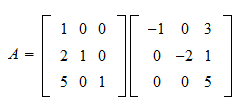
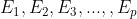
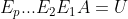
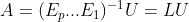
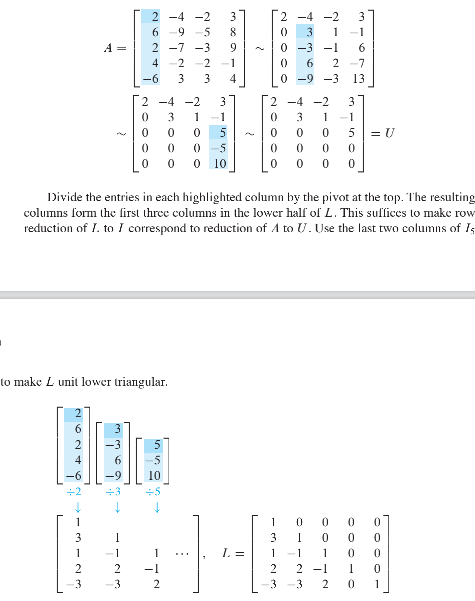
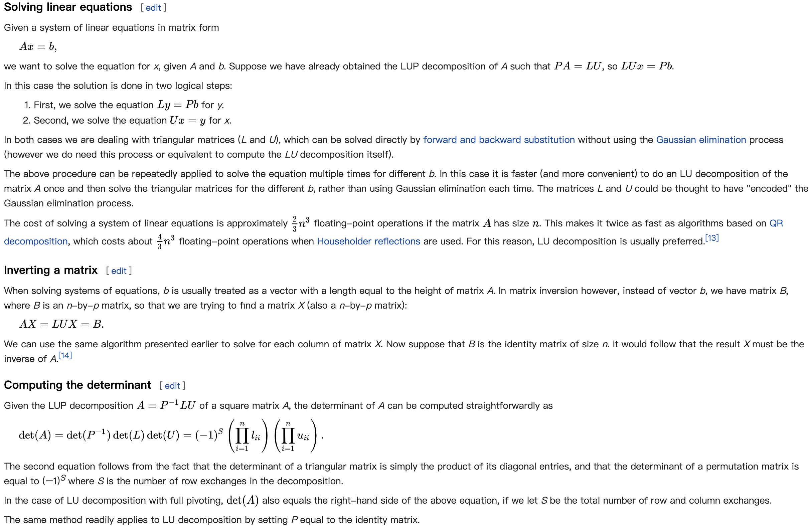

## LU factorization

### plain LU decomposition

#### definition

A = LU (L is a lower triangular matrix and U is an upper triangular matrix)

(from wiki)  
LU decomposition can be viewed as the matrix form of Gaussian elimination

#### Existence and uniqueness

Existence:      
When satisfied: 1. A is a square matrix.  
A has an LU decomposition _**IF:**_ A can be reduced to row echelon form by Gaussian elimination without ever interchanging two row
      
When satisfied: 1. A is a square matrix &nbsp;&nbsp;&nbsp;&nbsp;2.A is invertible      
A has an LU decomposition _**IF AND ONLY IF:**_ all its leading principal minors are nonzero
      
When satisfied: 1. A is a square matrix &nbsp;&nbsp;&nbsp;&nbsp; 2. A is irreversible   
A has an LU decomposition **_IF:_** the first k leading principal minors are nonzero
      

Uniqueness:  
the LU factorization is also unique if we require that the diagonal of L(or U) consists of ones.   
e.g.   

   

#### LU Factorization Algorithm

Suppose A can be reduced to an echelon form U using **_only row replacements_** (or A=LU would not exist, you can perform PA = LU)  
So there exist (unit lower triangular elementary matrices) let  
Then   
In breif, we can just perform Guassian elimination on A to reduce it into a row echelon form (U); And the same sequence of row operations would reduce L to I 

time complexity: O(N^3)

e.g. From: Lay, David C._ Lay, Steven R._ McDonald, Judith - Linear Algebra and Its Applications-Pearson  

### LU factorization with partial pivoting (LUP)

background knowledge: 1. for _**square matrix**_, a proper permutation in rows (or columns) is **_sufficient_** for LU factorization. 

So let:&nbsp;&nbsp;&nbsp; PA = LU  
(P is a permutation matrix, which, when left-multiplied to A, reorders the rows of A, when right-mutiplied to A, reorders the columns of A)
 

### applications

The key to these applications is that the triangular matrix is easy to calculate and has special properties

from: `https://en.wikipedia.org/wiki/LU_decomposition#cite_note-horn-cor355-5`

### References：  

`https://en.wikipedia.org/wiki/LU_decomposition#cite_note-horn-cor355-5 `
`https://www.statlect.com/matrix-algebra/lu-decomposition`