## Singular Value Decomposition(SVD)

### definition

**_Any matrix_** 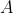 can be written as 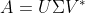  
 is an m x n real or complex matrix  
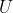 is an m x m real or complex **_unitary matrix_** called left-singular vectors   
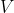 is an n x n real or complex **_unitary matrix_** called right-singular vectors 
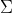 is an m x n rectangular diagonal matrix, with **_non-negative real numbers_** on the diagonal 

For **_real matrix_**  
 and  are **_unitary real orthogonal matrixs_**, which means they're matrixs of rotation transformation 
 is an **_real rectangular diagonal matrix_**, which means it is a matrix of translation transformation 
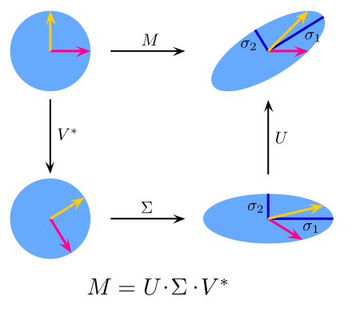(wiki) 
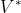 = 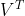 
 consists of r(rank) singular values

**_Uniqueness_** 
The SVD is not unique. It is always possible to choose the decomposition so that the singular values 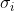(= 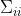) are in decending order. In this case,  (but not always  and ) is uniquely determined by .   (wiki)

### calculation

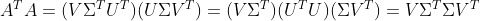 
similarily 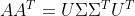 
So  are the eigenvectors of 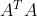,  are the eigenvectors of 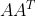 
the singularvalue  corresponds to the square root of  eigenvalue 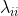 of  or , which means that  = 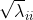 
e.g. TODO

### application

#### Moore-Penrose Pseudoinverse

#### Principal Components Analysis
See PCA
